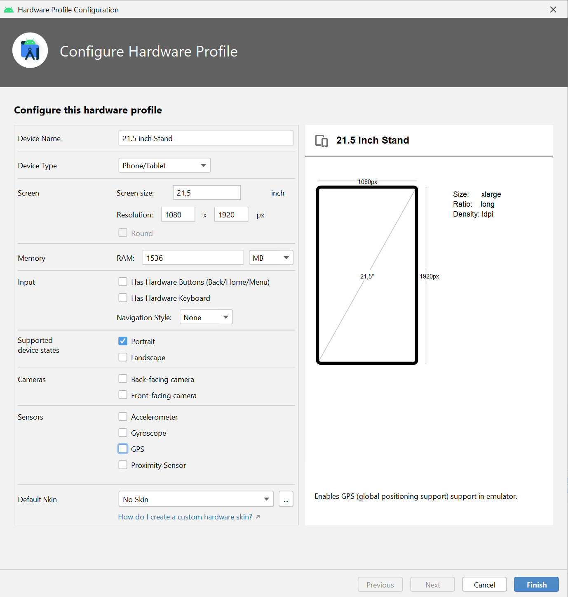

# kioskweb
kioskweb

Before you can use the kiosk browser, you need to follow some steps:

- Reset device to factory defaults (Do not create google or other account on the device!)
 
- Enable Developer Mode  (Default: Click 7 times on Settings->Info->Software Information->Buildnumber)

- Enable USB Debugging

- Set Lock Screen Type None

 
- Configure your target device via ADB
```
adb shell dpm set-device-owner de.ecube.kioskweb/.KioskDeviceAdminReceiver

# Grant Permission for Wifi Scan (Optional if using custom wifi settings):

adb shell pm grant de.ecube.kioskweb android.permission.ACCESS_FINE_LOCATION
adb shell pm grant de.ecube.kioskweb android.permission.CHANGE_NETWORK_STATE

adb shell pm grant de.ecube.kioskweb android.permission.WRITE_SECURE_SETTINGS

```

Some useful hints:

https://www.fully-kiosk.com/de/

https://developers.google.com/web/tools/chrome-devtools/remote-debugging/webviews

https://www.toptal.com/android/android-pos-app-tutorial

https://github.com/TilesOrganization/support/wiki/How-to-use-ADB-to-grant-permissions

Android 10
https://developer.android.com/guide/components/activities/background-starts

Hardware Profile for Android Emulator:



https://www.sisik.eu/blog/android/dev-admin/update-app
https://github.com/sixo/silent-update
https://www.andreasschrade.com/2015/02/16/android-tutorial-how-to-create-a-kiosk-mode-in-android/

https://developer.android.com/work/dpc/dedicated-devices/lock-task-mode

https://9to5google.com/2017/11/04/how-to-backup-restore-android-device-data-android-basics/

For Huawei Tablet:

After Factory Reset:

Settings->System->Build-Numberr tap 7 times -> developer

